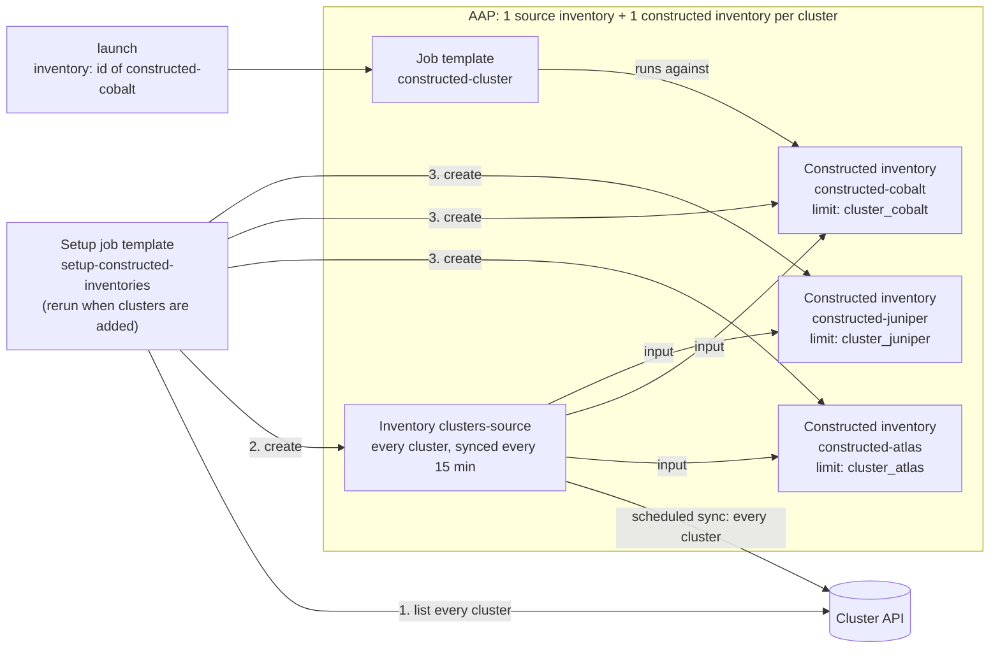

# Constructed: one API sync, one constructed inventory per cluster

One AAP inventory, `clusters-source`, holds every cluster. Its source runs
the `cluster_api` inventory plugin, the only thing that calls the cluster
API. Each cluster also gets a **constructed inventory**, named
`constructed-<name>`. It's a filtered view of `clusters-source`, limited to
the group `cluster_<name>`, that AAP builds from its own database. You pick
the cluster by picking the constructed inventory at launch. A setup playbook
creates everything from the cluster API, so you don't build it by hand.

This combines the other two stored approaches. Like [limit/](../limit/), the
API is synced once for all clusters. Like
[inventory-level/](../inventory-level/), each cluster is its own inventory
with its own **Use** permission, and the playbook needs no guard.

Constructed inventories need AAP 2.4 or later, or AWX 22 or later.

```
inventory/clusters.json                    # mock API response (replace with your real API)
inventory/cluster_api.yml                  # plugin config; the clusters-source source points here
inventory/inventory_plugins/cluster_api.py # inventory plugin; returns every cluster
playbook.yml                               # runs against whatever the selected inventory holds
aap/setup_constructed_inventories.yml      # creates clusters-source and one constructed inventory per cluster
aap/survey_spec.json                       # survey: target_group
```

## Why an inventory plugin instead of a script

The other folders use an inventory script. This one uses an inventory
plugin, the format Ansible recommends for new inventory sources:

- **Built-in grouping and variables.** `compose`, `groups`, and
  `keyed_groups` in [inventory/cluster_api.yml](inventory/cluster_api.yml)
  add host vars and groups without changing Python.
- **Settings in YAML.** The API URL, timeout, and certificate checking are
  options with documentation, read from the config file or from environment
  variables that a credential injects.
- **Safe failures.** Any API error, and any response with no clusters, fails
  the sync. A failed sync leaves the inventory as it was, so **Overwrite**
  can't delete every host because the API was down.
- **No packaging.** AAP runs `ansible-inventory` with `--playbook-dir` set to
  the config file's folder, so the plugin in the `inventory_plugins/` folder
  next to it loads with no collection to build or execution environment to
  change.

## How it scales

AAP gets one source inventory plus one constructed inventory per cluster: 10
clusters means 11 inventories, and 1,000 clusters means 1,001. Only
`clusters-source` calls the API, once per scheduled sync, no matter how many
clusters there are. Each constructed inventory rebuilds from AAP's database
before each job, which is quick and doesn't touch the API.



## Pros and cons

**Pros**
- One API sync covers every cluster, so API load stays flat as clusters are
  added.
- Per-cluster access control: grant **Use** on `constructed-cobalt` only to
  the team that owns cobalt, and they can't launch against any other
  cluster.
- The playbook is a plain playbook with no loader play or guard. A
  constructed inventory can only contain its own cluster, so a launch can't
  reach other clusters by mistake.
- Hosts can be browsed in the AAP UI, both all together in `clusters-source`
  and per cluster in each constructed inventory.
- Uses an inventory plugin, which fails safely when the API has problems.

**Cons**
- AAP objects grow with the cluster count: one constructed inventory each.
- New clusters need the setup playbook rerun. Constructed inventories for
  removed clusters stay until someone deletes them, and launches against
  them find no hosts.
- Data is only as fresh as the last scheduled sync (15 minutes here). A job
  on a constructed inventory rebuilds that inventory from `clusters-source`,
  but never syncs `clusters-source` from the API. See
  [Why the source inventory syncs on a schedule](#why-the-source-inventory-syncs-on-a-schedule).
- Every job starts with a short constructed inventory rebuild, which adds a
  few seconds.
- Callers have to look up the inventory ID before launching.
- The setup playbook needs an AAP credential with rights to create
  inventories.
- A launch that leaves out `inventory` silently runs on the template's
  default inventory, unless you set it to an empty one (see
  [step 4](#4-create-the-job-template)).
- Each constructed inventory still lists every `cluster_*` group, with only
  its own one holding hosts. That's how the constructed plugin works. It's
  untidy in the UI but does no harm.

## What you need

### Information

| Item | Used for | Example |
|---|---|---|
| Cluster API URL and auth method | Plugin options `api_url` and `api_token` | `https://cmdb.example.com/api` |
| How the API lists all clusters | `_fetch_clusters()` in the plugin | `GET /clusters` |
| API response fields for host name, role, and IP | Mapping to the plugin's format | see [Connecting your real API](#connecting-your-real-api) |
| How Ansible connects to the hosts | Machine credential | SSH user and key |
| Git repo URL and branch | AAP Project | `https://github.com/ryancbutler/aap-inventory.git`, `main` |
| AAP organization, Project name, and execution environment | Setup playbook `vars:` and job templates | `Default`, `aap-inventory`, `ee-supported-rhel9` |
| How stale data may get | Schedule on the `clusters-source` source | `15` minutes |

### Credentials

| Credential | Type | Attach to | Needed when |
|---|---|---|---|
| AAP API | Red Hat Ansible Automation Platform | Setup job template | Always. The setup playbook creates inventories through the AAP API. |
| Host access | Machine | Main job template | Always, for real hosts (the demo uses a local connection) |
| Git access | Source Control | Project | Only if the repo is private |
| Cluster API | Custom credential type | Setup job template **and** the `clusters-source-api` source | Only if the API needs auth (see below) |

**AAP API credential:** use a dedicated service account that's **Admin** of
the organization, or has inventory admin rights in it, plus **Use** on the
Project. On AWX, it must be a local user: AWX won't issue the OAuth2 token the
modules need to users who log in through SSO. AAP 2.5 doesn't have that
restriction.

**If your cluster API needs auth:** create a custom credential type
(**Automation Execution → Infrastructure → Credential Types**) with this
injector configuration:

```yaml
env:
  CLUSTER_API_URL: "{{ url }}"
  CLUSTER_API_TOKEN: "{{ token }}"
```

and these input fields:

```yaml
fields:
  - id: url
    type: string
    label: Cluster API URL
  - id: token
    type: string
    label: Token
    secret: true
required: [url, token]
```

The plugin reads both variables, so nothing in the repo holds the URL or
token. Create a credential of that type, attach it to the setup job template
(the setup playbook runs the plugin to list clusters), and set
`cluster_api_credential` in the setup playbook's `vars:` to its name so the
`clusters-source-api` source gets it too. The constructed inventories never
call the API, so they don't need it.

### Permissions for whoever launches

| Who | Role needed |
|---|---|
| User or service account launching jobs | **Execute** on `constructed-cluster`, plus **Use** on each `constructed-*` inventory they may target |
| Whoever runs the setup playbook | **Execute** on `setup-constructed-inventories` |

Launchers don't need any role on `clusters-source`. AAP rejects a launch
whose `inventory` the caller can't **Use**, which is what makes per-cluster
access control work.

## Setup in AAP

### 1. Create the Project
**Automation Execution → Projects → Create**
- Name: `aap-inventory`. The setup playbook looks the Project up by this
  name, so change `project_name` in its `vars:` if you use another one.
- Source control type: Git
- URL: `https://github.com/ryancbutler/aap-inventory.git`, branch `main`
- Source control credential: only if the repo is private
- Save, then sync it and wait for **Successful**.

### 2. Create the AAP API credential
**Automation Execution → Infrastructure → Credentials → Create**
- Type: **Red Hat Ansible Automation Platform**
- Host: your AAP URL, plus the username and password (or token) of the
  service account described in [Credentials](#credentials)
- Turn off **Verify SSL** only if AAP uses a self-signed certificate.

### 3. Create and run the setup job template
**Automation Execution → Templates → Create job template**
- Name: `setup-constructed-inventories`
- Inventory: any. The playbook runs on `localhost`.
- Project: `aap-inventory`, Playbook: `constructed/aap/setup_constructed_inventories.yml`
- Execution environment: one with `ansible.controller`, such as
  `ee-supported-rhel9`. On AWX, the default AWX EE works because it has
  `awx.awx`. The playbook uses whichever one is installed.
- Credentials: the AAP API credential from step 2, plus the Cluster API
  credential if you created one

Check the `vars:` at the top of
[aap/setup_constructed_inventories.yml](aap/setup_constructed_inventories.yml):

| Var | Default | Meaning |
|---|---|---|
| `organization` | `Default` | Organization the inventories are created in |
| `project_name` | `aap-inventory` | Project the source reads the plugin from |
| `source_inventory` | `clusters-source` | Name of the inventory that holds every cluster |
| `constructed_prefix` | `constructed-` | Constructed inventories are named `<prefix><cluster>` |
| `plugin_config_path` | `constructed/inventory/cluster_api.yml` | Plugin config path inside the Project |
| `cluster_api_credential` | empty | Cluster API credential to attach to the source |
| `sync_every_minutes` | `15` | How often `clusters-source` re-syncs from the API |
| `sync_now` | `true` | Sync everything right after creating it |

Launch it. It asks the plugin for every cluster, then:

1. Creates `clusters-source` with the source `clusters-source-api`, adds a
   schedule that syncs it every 15 minutes, and syncs it once now.
2. For each cluster, creates constructed inventory `constructed-<name>` with
   `clusters-source` as its only input, sets its limit to `cluster_<name>`,
   and builds it.

Afterwards, **Inventories** shows `clusters-source` with 40 hosts and one
`constructed-*` inventory per cluster, each with 4 hosts.

If you'd rather build them by hand:

**`clusters-source`** (a normal inventory), with one source:

| Field | Value |
|---|---|
| Name | `clusters-source-api` |
| Source | Sourced from a Project → `aap-inventory` |
| Inventory file | `constructed/inventory/cluster_api.yml` |
| Credential | the Cluster API credential, if you created one |
| Options | Overwrite, Overwrite variables. Leave **Update on launch** off. |
| Schedule | every 15 minutes, on the source's **Schedules** tab |

**`constructed-cobalt`**: **Create inventory → Create constructed
inventory**:

| Field | Value |
|---|---|
| Input inventories | `clusters-source` |
| Limit | `cluster_cobalt` |
| Source vars | `plugin: constructed` and `strict: true` |
| Update on launch | on, cache timeout `0` |

### 4. Create the job template
**Automation Execution → Templates → Create job template**
- Name: `constructed-cluster`
- Inventory: an **empty** inventory (create one with no hosts if needed), with
  **Prompt on launch** turned on. If the default is a real cluster, a launch
  that leaves out `inventory` silently runs against that cluster.
- Project: `aap-inventory`, Playbook: `constructed/playbook.yml`
- Execution environment: any with `ansible-core`
- Credentials: your Machine credential

### 5. Add the survey
Open the template's **Survey** tab, add the question from
[aap/survey_spec.json](aap/survey_spec.json), and turn the survey **on**:

| Question | Variable | Type | Required |
|---|---|---|---|
| Which hosts in the cluster? | `target_group` | Multiple choice: `all`, `frontend`, `app`, `db` (default `all`) | no |

Leave it optional. AAP rejects API launches that leave out a required
question, even when the question has a default.

### 6. Test it
Launch the template from the UI and choose `constructed-cobalt` when it asks
for an inventory. The job output should start with a short inventory update
and then show one line per cobalt host.

## Launching

```bash
# 1. Find the inventory ID. "count": 0 means there's no such cluster.
curl -k -H "Authorization: Bearer $AAP_TOKEN" \
  "https://AAP_HOST/api/controller/v2/inventories/?name=constructed-cobalt"

# 2. Launch against it.
curl -k -H "Authorization: Bearer $AAP_TOKEN" -H "Content-Type: application/json" \
  -X POST https://AAP_HOST/api/controller/v2/job_templates/<ID>/launch/ \
  -d '{"inventory": <INVENTORY_ID>, "extra_vars": {"target_group": "frontend"}}'
```

On AWX or AAP 2.4 and earlier, use `/api/v2/...` instead of
`/api/controller/v2/...`.

> **Launch fields are silently dropped unless the template accepts them.**
> `inventory` needs **Prompt on launch** on the Inventory field, and
> `extra_vars` needs the survey turned on. If the launch response lists either
> one under `ignored_fields`, the template's default was used instead.

### Launch results

| Launch with | Result |
|---|---|
| `inventory: <constructed-cobalt>` | runs on all 4 cobalt hosts |
| `inventory: <constructed-atlas>`, `target_group: db` | runs on `atlas-db01` only |
| cluster that doesn't exist | no `constructed-*` inventory to look up, so there's nothing to launch |
| inventory of a cluster removed from the API | rebuild finds no hosts; job **succeeds** with `no hosts matched` |
| no `inventory` | runs on the template's default inventory |
| cluster API down | the scheduled sync fails and `clusters-source` keeps its last good hosts; jobs keep running on them |

## Why the source inventory syncs on a schedule

When a job starts, AAP only syncs the sources of the job's own inventory
that have **Update on launch** on. A constructed inventory's only source is
the constructed one, which rebuilds from what `clusters-source` holds in
AAP's database. It doesn't sync `clusters-source` from the API, even if
`clusters-source-api` has **Update on launch** on. So `clusters-source` needs
its own trigger. A schedule is the simplest.

If 15 minutes is too stale for some jobs, either:
- lower `sync_every_minutes` and rerun the setup playbook, or
- launch through a **workflow job template** whose first node is an
  inventory sync of `clusters-source-api` and whose second node is
  `constructed-cluster`.

## Day-2 processes

| Change in the cluster API | What to do in AAP | When it takes effect |
|---|---|---|
| Host added | nothing | next scheduled sync of `clusters-source` |
| Host removed | nothing; **Overwrite** deletes it from `clusters-source`, and the next rebuild drops it from the constructed inventory | next scheduled sync |
| Cluster added | rerun `setup-constructed-inventories` | after the setup job finishes |
| Cluster removed | delete the `constructed-<name>` inventory by hand | right away. Until then, launches against it succeed with no hosts. |

To force a sync now, open `clusters-source`, go to **Sources**, and click
**Sync**. The setup playbook never deletes inventories, so a removed cluster
can't take an inventory (and the permissions granted on it) down with it by
mistake.

## Connecting your real API

1. Set the API URL. Either use the Cluster API credential described in
   [Credentials](#credentials), or add `api_url:` to
   [inventory/cluster_api.yml](inventory/cluster_api.yml). With no URL, the
   plugin reads `clusters.json`.
2. If your API's response doesn't look like this, edit `_fetch_clusters()` in
   [inventory/inventory_plugins/cluster_api.py](inventory/inventory_plugins/cluster_api.py)
   to map it:

   ```json
   {"clusters": [{"name": "cobalt", "hosts": [{"hostname": "cobalt-fe01", "role": "frontend", "ip": "10.3.0.11"}]}]}
   ```

3. Delete the `compose:` block in
   [inventory/cluster_api.yml](inventory/cluster_api.yml). It forces a local
   connection for the demo. The plugin already sets `ansible_host` from the
   IP.
4. Commit, push, sync the Project, then rerun the setup playbook.

The plugin makes its HTTP calls with Ansible's own `open_url`, so the
execution environment needs no extra Python libraries.

## Run it locally

From this folder. `--playbook-dir` is what lets `ansible-inventory` find the
plugin next to the config, as AAP does:

```bash
ansible-inventory -i inventory/cluster_api.yml --playbook-dir inventory --graph
ansible-inventory -i inventory/cluster_api.yml --playbook-dir inventory --host cobalt-fe01
CLUSTER_API_URL=https://cmdb.example.com/api \
  ansible-inventory -i inventory/cluster_api.yml --playbook-dir inventory --graph
```

To see what a constructed inventory would hold, apply its limit to the
playbook. `--limit` does the same filtering as the constructed inventory's
limit:

```bash
ANSIBLE_INVENTORY_PLUGINS=inventory/inventory_plugins \
  ansible-playbook -i inventory/cluster_api.yml playbook.yml --limit cluster_cobalt -e target_group=frontend
```

The setup playbook runs locally too, with `ansible.controller` or `awx.awx`
installed:

```bash
CONTROLLER_HOST=https://AAP_HOST CONTROLLER_USERNAME=svc-user CONTROLLER_PASSWORD=... \
  ansible-playbook aap/setup_constructed_inventories.yml
```
