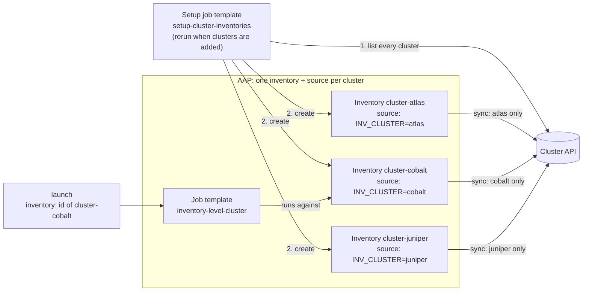

# Inventory level: one AAP inventory per cluster

Each cluster gets its own AAP inventory, named `cluster-<name>`. That
inventory's source runs the inventory script with `INV_CLUSTER` set in
**Source variables**, so it only ever holds that cluster's hosts. You pick the
cluster by picking the inventory at launch. A setup playbook creates the
inventories from the cluster API, so you don't build them by hand.

```
inventory/clusters.json            # mock API response (replace with your real API)
inventory/dynamic_inventory.py     # inventory script; INV_CLUSTER filters to one cluster
playbook.yml                       # runs against whatever the selected inventory holds
aap/setup_cluster_inventories.yml  # creates and syncs one AAP inventory per cluster
aap/survey_spec.json               # survey: target_group
```

## How it scales

AAP gets one inventory and one inventory source per cluster: 10 clusters
means 10 inventories, and 1,000 clusters means 1,000. Each source syncs only
its own cluster. The setup playbook creates them and has to be rerun when
clusters are added.



## Pros and cons

**Pros**
- Hosts are stored per cluster and can be browsed in the AAP UI, with their
  variables and job history.
- Per-cluster access control: grant **Use** on `cluster-cobalt` only to the
  team that owns cobalt, and they can't launch against any other cluster.
- The playbook is a plain playbook with no loader play or guard, so existing
  playbooks work unchanged.
- Each sync fetches only one cluster, so syncs stay small.
- A cluster that doesn't exist has no inventory to select.

**Cons**
- AAP objects grow with the cluster count: one inventory and one source each.
- New clusters need the setup playbook rerun. Inventories for removed
  clusters stay until someone deletes them.
- Callers have to look up the inventory ID before launching.
- The setup playbook needs an AAP credential with rights to create
  inventories.
- A launch that leaves out `inventory` silently runs on the template's default
  inventory, which is a real cluster unless you set it to an empty one (see
  [step 4](#4-create-the-job-template)).
- With **Update on launch** caching, a removed host can still be targeted for
  up to the cache timeout (300 seconds here).

## What you need

### Information

| Item | Used for | Example |
|---|---|---|
| Cluster API URL and auth method | `fetch_clusters()` in the inventory script | `https://cmdb.example.com/api` |
| How the API lists all clusters, and filters by one | Setup playbook (all), each inventory source (one) | `GET /clusters`, `GET /clusters?name=cobalt` |
| API response fields for host name, role, and IP | Mapping to the script's format | see [Connecting your real API](#connecting-your-real-api) |
| How Ansible connects to the hosts | Machine credential | SSH user and key |
| Git repo URL and branch | AAP Project | `https://github.com/ryancbutler/aap-inventory.git`, `main` |
| AAP organization, Project name, and execution environment | Setup playbook `vars:` and job templates | `Default`, `aap-inventory`, `ee-supported-rhel9` |
| How often to re-sync | Inventory source cache timeout | `300` seconds |

### Credentials

| Credential | Type | Attach to | Needed when |
|---|---|---|---|
| AAP API | Red Hat Ansible Automation Platform | Setup job template | Always. The setup playbook creates inventories through the AAP API. |
| Host access | Machine | Main job template | Always, for real hosts (the demo uses a local connection) |
| Git access | Source Control | Project | Only if the repo is private |
| Cluster API | Custom credential type | Setup job template **and** every inventory source | Only if the API needs auth (see below) |

**AAP API credential:** use a dedicated service account that's **Admin** of
the organization, or has inventory admin rights in it, plus **Use** on the
Project. On AWX, it must be a local user: AWX won't issue the OAuth2 token the
modules need to users who log in through SSO. AAP 2.5 doesn't have that
restriction.

**If your cluster API needs auth:** create a custom credential type
(**Automation Execution → Infrastructure → Credential Types**) whose injector
sets an environment variable, for example `CLUSTER_API_TOKEN`, and read that
variable in `fetch_clusters()`. Attach it to the setup job template, because
the setup playbook runs the script to list clusters. Also add
`credential: <name>` to the "Add a source" task in the setup playbook, so
every inventory source gets it.

### Permissions for whoever launches

| Who | Role needed |
|---|---|
| User or service account launching jobs | **Execute** on `inventory-level-cluster`, plus **Use** on each `cluster-*` inventory they may target |
| Whoever runs the setup playbook | **Execute** on `setup-cluster-inventories` |

AAP rejects a launch whose `inventory` the caller can't **Use**. That's what
makes per-cluster access control work.

## Setup in AAP

### 1. Create the Project
**Automation Execution → Projects → Create**
- Name: `aap-inventory`. The setup playbook looks the Project up by this
  name, so change `project_name` in its `vars:` if you use another one.
- Source control type: Git
- URL: `https://github.com/ryancbutler/aap-inventory.git`, branch `main`
- Source control credential: only if the repo is private
- Save, then sync it and wait for **Successful**.

### 2. Create the AAP API credential
**Automation Execution → Infrastructure → Credentials → Create**
- Type: **Red Hat Ansible Automation Platform**
- Host: your AAP URL, plus the username and password (or token) of the
  service account described in [Credentials](#credentials)
- Turn off **Verify SSL** only if AAP uses a self-signed certificate.

### 3. Create and run the setup job template
**Automation Execution → Templates → Create job template**
- Name: `setup-cluster-inventories`
- Inventory: any. The playbook runs on `localhost`.
- Project: `aap-inventory`, Playbook: `inventory-level/aap/setup_cluster_inventories.yml`
- Execution environment: one with `ansible.controller`, such as
  `ee-supported-rhel9`. On AWX, the default AWX EE works because it has
  `awx.awx`. The playbook uses whichever one is installed.
- Credentials: the AAP API credential from step 2

Check the `vars:` at the top of
[aap/setup_cluster_inventories.yml](aap/setup_cluster_inventories.yml):

| Var | Default | Meaning |
|---|---|---|
| `organization` | `Default` | Organization the inventories are created in |
| `project_name` | `aap-inventory` | Project the inventory sources read the script from |
| `inventory_prefix` | `cluster-` | Inventories are named `<prefix><cluster>` |
| `script_path` | `inventory-level/inventory/dynamic_inventory.py` | Script path inside the Project |
| `sync_now` | `true` | Sync each inventory right after creating it |

Launch it. It asks the script for every cluster, then for each one creates
inventory `cluster-<name>` and source `<name>-api`, and syncs it. Afterwards,
**Inventories** shows one `cluster-*` inventory per cluster, each with 4
hosts.

Each source it creates looks like this, if you'd rather build one by hand:

| Field | Value |
|---|---|
| Source | Sourced from a Project → `aap-inventory` |
| Inventory file | `inventory-level/inventory/dynamic_inventory.py` |
| Source variables | `INV_CLUSTER: cobalt` |
| Options | Overwrite, Overwrite variables, Update on launch (cache timeout 300) |

**Overwrite** is what removes hosts the API no longer returns. Leave it on.

### 4. Create the job template
**Automation Execution → Templates → Create job template**
- Name: `inventory-level-cluster`
- Inventory: an **empty** inventory (create one with no hosts if needed), with
  **Prompt on launch** turned on. If the default is a real cluster, a launch
  that leaves out `inventory` silently runs against that cluster.
- Project: `aap-inventory`, Playbook: `inventory-level/playbook.yml`
- Execution environment: any with `ansible-core`
- Credentials: your Machine credential

### 5. Add the survey
Open the template's **Survey** tab, add the question from
[aap/survey_spec.json](aap/survey_spec.json), and turn the survey **on**:

| Question | Variable | Type | Required |
|---|---|---|---|
| Which hosts in the cluster? | `target_group` | Multiple choice: `all`, `frontend`, `app`, `db` (default `all`) | no |

Leave it optional. AAP rejects API launches that leave out a required
question, even when the question has a default.

### 6. Test it
Launch the template from the UI and choose `cluster-cobalt` when it asks for
an inventory. The output should show one line per cobalt host.

## Launching

```bash
# 1. Find the inventory ID. "count": 0 means there's no such cluster.
curl -k -H "Authorization: Bearer $AAP_TOKEN" \
  "https://AAP_HOST/api/controller/v2/inventories/?name=cluster-cobalt"

# 2. Launch against it.
curl -k -H "Authorization: Bearer $AAP_TOKEN" -H "Content-Type: application/json" \
  -X POST https://AAP_HOST/api/controller/v2/job_templates/<ID>/launch/ \
  -d '{"inventory": <INVENTORY_ID>, "extra_vars": {"target_group": "frontend"}}'
```

On AWX or AAP 2.4 and earlier, use `/api/v2/...` instead of
`/api/controller/v2/...`.

> **Launch fields are silently dropped unless the template accepts them.**
> `inventory` needs **Prompt on launch** on the Inventory field, and
> `extra_vars` needs the survey turned on. If the launch response lists either
> one under `ignored_fields`, the template's default was used instead.

### Launch results

| Launch with | Result |
|---|---|
| `inventory: <cluster-cobalt>` | runs on all 4 cobalt hosts |
| `inventory: <cluster-atlas>`, `target_group: db` | runs on `atlas-db01` only |
| cluster that doesn't exist | no `cluster-*` inventory to look up, so there's nothing to launch |
| inventory of a cluster removed from the API | sync returns no hosts; job **succeeds** with `no hosts matched` |
| no `inventory` | runs on the template's default inventory |

## Day-2 processes

| Change in the cluster API | What to do in AAP | When it takes effect |
|---|---|---|
| Host added | nothing | next sync: the next launch after the 300-second cache expires |
| Host removed | nothing; **Overwrite** deletes it | next sync |
| Cluster added | rerun `setup-cluster-inventories` | after the setup job finishes |
| Cluster removed | delete the `cluster-<name>` inventory by hand | right away. Until then, launches against it succeed with no hosts. |

To force a sync now, open the inventory, go to **Sources**, and click
**Sync**. The setup playbook never deletes inventories, so a removed cluster
can't take an inventory down with it by mistake.

## Connecting your real API

1. Edit `fetch_clusters()` in
   [inventory/dynamic_inventory.py](inventory/dynamic_inventory.py) so it
   calls your API. The docstring has a `requests` example. It must return:

   ```json
   [{"name": "cobalt", "hosts": [{"hostname": "cobalt-fe01", "role": "frontend", "ip": "10.3.0.11"}]}]
   ```

2. Filter on the API side if it can. Each source asks for one cluster, and
   the setup playbook asks for all of them.
3. Replace `"ansible_connection": "local"` with `"ansible_host": host["ip"]`
   in the script.
4. If the API needs auth, add the Cluster API credential described in
   [Credentials](#credentials).
5. Make sure the execution environment has any Python libraries the script
   imports, such as `requests`.
6. Commit, push, sync the Project, then rerun the setup playbook.

## Run it locally

From this folder:

```bash
INV_CLUSTER=cobalt ansible-inventory -i inventory/dynamic_inventory.py --graph
INV_CLUSTER=cobalt ansible-playbook -i inventory/dynamic_inventory.py playbook.yml -e target_group=frontend
INV_CLUSTER=nope   ansible-playbook -i inventory/dynamic_inventory.py playbook.yml   # no hosts matched
```

The setup playbook runs locally too, with `ansible.controller` or `awx.awx`
installed:

```bash
CONTROLLER_HOST=https://AAP_HOST CONTROLLER_USERNAME=svc-user CONTROLLER_PASSWORD=... \
  ansible-playbook aap/setup_cluster_inventories.yml
```
