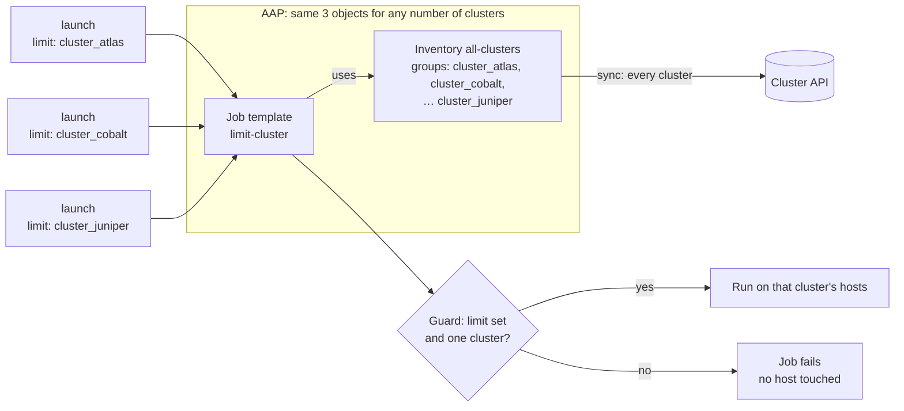

# Limit: one inventory, cluster chosen by the job's limit

One AAP inventory holds every cluster, and each cluster is a group named
`cluster_<name>`. You pick the cluster at launch with the job's **limit**,
for example `cluster_cobalt`. The playbook stops before touching any host
unless the limit selects exactly one cluster.

```
inventory/clusters.json            # mock API response (replace with your real API)
inventory/dynamic_inventory.py     # inventory script; returns every cluster
playbook.yml                       # checks the limit, then runs against that cluster
aap/survey_spec.json               # survey: target_group
```

## How it scales

The AAP objects stay the same as clusters are added: one inventory, one
source, and one job template. The inventory gets one group per cluster. Each
sync pulls every cluster from the API, so sync time and API load grow with the
total host count.



## Pros and cons

**Pros**
- Few AAP objects: one inventory, one source, and one job template, no matter
  how many clusters exist.
- Hosts are stored and can be browsed in the AAP UI, all in one place, with
  one group per cluster.
- New clusters show up after the next sync, with no AAP changes.
- Callers pass a group name. They don't need to look up an ID.
- The playbook guard stops a missing or too-broad limit before any host is
  touched.

**Cons**
- Every sync pulls every cluster, so syncs get slower and heavier as the
  total host count grows.
- No per-cluster access control. Anyone who can run the job template can
  target any cluster.
- Every playbook that uses this inventory needs the guard tasks. A playbook
  without them runs on every host when the limit is left out.
- The limit is a free-form host pattern, so callers have to know the group
  naming: `prod-east` becomes `cluster_prod_east`.
- With **Update on launch** caching, a new cluster can be missing, or a
  removed host still targeted, for up to the cache timeout (300 seconds here).

## What you need

### Information

| Item | Used for | Example |
|---|---|---|
| Cluster API URL and auth method | `fetch_clusters()` in the inventory script | `https://cmdb.example.com/api` |
| How the API lists all clusters | The inventory source | `GET /clusters` |
| API response fields for host name, role, and IP | Mapping to the script's format | see [Connecting your real API](#connecting-your-real-api) |
| Cluster names | Callers build the limit as `cluster_<name>` | `cobalt` → `cluster_cobalt` |
| How Ansible connects to the hosts | Machine credential | SSH user and key |
| Git repo URL and branch | AAP Project | `https://github.com/ryancbutler/aap-inventory.git`, `main` |
| AAP organization and execution environment | Inventory and job template | `Default`, `ee-supported-rhel9` |
| How often to re-sync | Inventory source cache timeout | `300` seconds |

### Credentials

| Credential | Type | Attach to | Needed when |
|---|---|---|---|
| Host access | Machine | Job template | Always, for real hosts (the demo uses a local connection) |
| Git access | Source Control | Project | Only if the repo is private |
| Cluster API | Custom credential type | Inventory source `all-clusters-api` | Only if the API needs auth (see below) |

No AAP or controller credential is needed. Nothing calls the AAP API except
whoever launches the job.

**If your cluster API needs auth:** create a custom credential type
(**Automation Execution → Infrastructure → Credential Types**) whose injector
sets an environment variable, for example `CLUSTER_API_TOKEN`, and read that
variable in `fetch_clusters()`. Attach it to the inventory source, which is
what runs the script.

### Permissions for whoever launches

| Who | Role needed |
|---|---|
| User or service account launching jobs | **Execute** on the `limit-cluster` job template |

## Setup in AAP

### 1. Create the Project
**Automation Execution → Projects → Create**
- Name: `aap-inventory`
- Source control type: Git
- URL: `https://github.com/ryancbutler/aap-inventory.git`, branch `main`
- Source control credential: only if the repo is private
- Save, then sync it and wait for **Successful**.

### 2. Create the inventory
**Automation Execution → Infrastructure → Inventories → Create inventory**
- Name: `all-clusters`

### 3. Add the inventory source
Open `all-clusters`, then **Sources → Create source**:

| Field | Value |
|---|---|
| Name | `all-clusters-api` |
| Source | Sourced from a Project → `aap-inventory` |
| Inventory file | `limit/inventory/dynamic_inventory.py` |
| Credential | the Cluster API credential, if you created one |
| Source variables | none. Leaving out `INV_CLUSTER` returns every cluster. |
| Options | Overwrite, Overwrite variables, Update on launch |
| Cache timeout | `300` |

Save, then click **Sync**. After it finishes, the inventory should have 40
hosts and the groups `cluster_atlas` … `cluster_juniper`, plus `frontend`,
`app`, and `db`. **Overwrite** removes hosts the API no longer returns, so
leave it on.

### 4. Create the job template
**Automation Execution → Templates → Create job template**
- Name: `limit-cluster`
- Inventory: `all-clusters`
- Project: `aap-inventory`, Playbook: `limit/playbook.yml`
- Execution environment: any with `ansible-core`
- Credentials: your Machine credential
- Limit: leave **empty**, and turn on **Prompt on launch**

### 5. Add the survey
Open the template's **Survey** tab, add the question from
[aap/survey_spec.json](aap/survey_spec.json), and turn the survey **on**:

| Question | Variable | Type | Required |
|---|---|---|---|
| Which hosts in the cluster? | `target_group` | Multiple choice: `all`, `frontend`, `app`, `db` (default `all`) | no |

Leave it optional. AAP rejects API launches that leave out a required
question, even when the question has a default.

### 6. Test it
Launch the template from the UI and enter `cluster_cobalt` when it asks for
a limit. The output should show one line per cobalt host. Then launch with no
limit: the job should fail with `No limit set`.

## Launching

```bash
curl -k -H "Authorization: Bearer $AAP_TOKEN" -H "Content-Type: application/json" \
  -X POST https://AAP_HOST/api/controller/v2/job_templates/<ID>/launch/ \
  -d '{"limit": "cluster_cobalt", "extra_vars": {"target_group": "frontend"}}'
```

On AWX or AAP 2.4 and earlier, use `/api/v2/...` instead of
`/api/controller/v2/...`.

> **Launch fields are silently dropped unless the template accepts them.**
> `limit` needs **Prompt on launch** on the Limit field, and `extra_vars`
> needs the survey turned on. If the launch response lists either one under
> `ignored_fields`, the template's default was used instead. A dropped limit
> is caught by the guard, so the job fails instead of running everywhere.

### Launch results

| Launch with | Result |
|---|---|
| `limit: cluster_cobalt` | runs on all 4 cobalt hosts |
| `limit: cluster_cobalt`, `target_group: frontend` | runs on `cobalt-fe01`, `cobalt-fe02` only |
| `limit: cluster_cobalt:&frontend` | same as above, without the survey |
| `limit: cluster_nope` | job **fails**: `--limit leaves us with no hosts to target` |
| no limit | job **fails**: `No limit set. Launch with a limit such as cluster_cobalt, or this would run on every cluster.` |
| `limit: all` (or `cluster_a,cluster_b`) | job **fails**: `Limit 'all' selects 10 clusters (...). Use one, e.g. cluster_cobalt.` |

The two guard tasks run once, before any other task, with
`any_errors_fatal`, so a bad limit stops the job before any host runs any
work. They're needed because AAP can't make the limit field required.

An unknown cluster fails the job here, unlike the other two approaches.
`ansible-playbook` itself refuses to start when the limit matches nothing.

## Day-2 processes

| Change in the cluster API | What to do in AAP | When it takes effect |
|---|---|---|
| Host added | nothing | next sync: the next launch after the 300-second cache expires |
| Host removed | nothing; **Overwrite** deletes it | next sync |
| Cluster added | nothing; its `cluster_<name>` group appears | next sync. Until then, launches for it fail with no hosts matched. |
| Cluster removed | nothing; **Overwrite** deletes its group and hosts | next sync |

To force a sync now, open `all-clusters`, go to **Sources**, and click
**Sync**.

When you add another playbook that uses `all-clusters`, copy the two guard
tasks from [playbook.yml](playbook.yml) into it.

## Connecting your real API

1. Edit `fetch_clusters()` in
   [inventory/dynamic_inventory.py](inventory/dynamic_inventory.py) so it
   calls your API. The docstring has a `requests` example. It must return
   every cluster:

   ```json
   [{"name": "cobalt", "hosts": [{"hostname": "cobalt-fe01", "role": "frontend", "ip": "10.3.0.11"}]}]
   ```

2. Replace `"ansible_connection": "local"` with `"ansible_host": host["ip"]`
   in the script.
3. If the API needs auth, add the Cluster API credential described in
   [Credentials](#credentials).
4. Make sure the execution environment has any Python libraries the script
   imports, such as `requests`.
5. Commit, push, sync the Project, then sync `all-clusters`.

## Run it locally

From this folder:

```bash
ansible-inventory -i inventory/dynamic_inventory.py --graph
ansible-playbook -i inventory/dynamic_inventory.py playbook.yml --limit cluster_cobalt
ansible-playbook -i inventory/dynamic_inventory.py playbook.yml --limit cluster_cobalt -e target_group=frontend
ansible-playbook -i inventory/dynamic_inventory.py playbook.yml              # fails: no limit
ansible-playbook -i inventory/dynamic_inventory.py playbook.yml --limit all  # fails: 10 clusters
```
