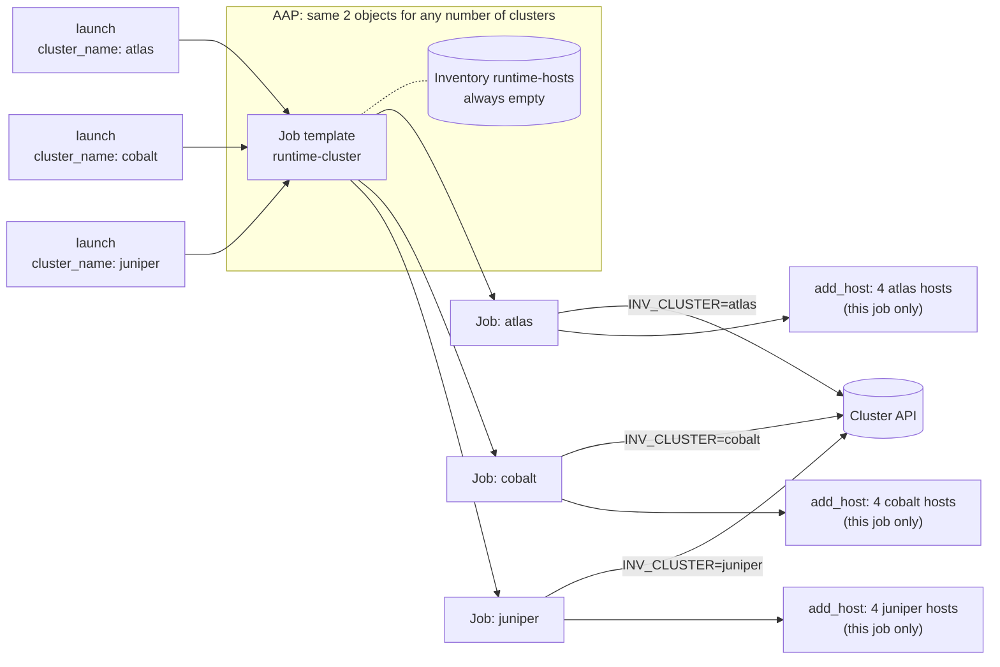

# Runtime: load one cluster during the job

The cluster name is passed at launch as an extra var. The playbook's first
play asks the cluster API for that one cluster and adds its hosts to the job
in memory with `add_host`. The second play runs against those hosts. Nothing
is stored in an AAP inventory, so AAP never needs updating when clusters or
hosts change.

```
inventory/clusters.json            # mock API response (replace with your real API)
inventory/dynamic_inventory.py     # inventory script; INV_CLUSTER filters to one cluster
playbook.yml                       # play 1 loads the cluster, play 2 runs against it
aap/survey_spec.json               # survey: cluster_name, target_group
```

## How it scales

The AAP objects stay the same whether you have 10 clusters or 1,000: one job
template and one empty inventory. Each job fetches only the cluster it was
asked for, and its hosts disappear when the job ends.



## Pros and cons

**Pros**
- Fewest AAP objects: one job template and one empty inventory, no matter how
  many clusters exist.
- Always current. The API is queried at the start of every job, with no sync
  and no cache.
- New clusters work immediately and removed hosts simply stop appearing. AAP
  never needs changing.
- Each job fetches only the cluster it needs.
- Callers pass a plain cluster name. They don't need to look up an ID.

**Cons**
- Hosts never appear in an AAP inventory, so you can't browse them in the UI.
  Job output and host summaries still show them by name.
- No per-cluster access control. Anyone who can run the job template can
  target any cluster.
- Every playbook that wants this needs the loader play (play 1) in front of
  it, or an `import_playbook` of it.
- Every job depends on the cluster API being up. If it's down, the job fails.
- A mistyped cluster name succeeds with no hosts by default. See
  [Launch results](#launch-results) to make it fail instead.

## What you need

### Information

| Item | Used for | Example |
|---|---|---|
| Cluster API URL and auth method | `fetch_clusters()` in the inventory script | `https://cmdb.example.com/api` |
| How the API filters by cluster | Fetching only one cluster per job | `GET /clusters?name=cobalt` |
| API response fields for host name, role, and IP | Mapping to the script's format | see [Connecting your real API](#connecting-your-real-api) |
| How Ansible connects to the hosts | Machine credential | SSH user and key |
| Git repo URL and branch | AAP Project | `https://github.com/ryancbutler/aap-inventory.git`, `main` |
| AAP organization and execution environment | Project and job template | `Default`, `ee-supported-rhel9` |

### Credentials

| Credential | Type | Attach to | Needed when |
|---|---|---|---|
| Host access | Machine | Job template | Always, for real hosts (the demo uses a local connection) |
| Git access | Source Control | Project | Only if the repo is private |
| Cluster API | Custom credential type | Job template | Only if the API needs auth (see below) |

No AAP or controller credential is needed. The playbook never calls the AAP
API.

**If your cluster API needs auth:** create a custom credential type
(**Automation Execution → Infrastructure → Credential Types**) whose injector sets an environment
variable, for example `CLUSTER_API_TOKEN`, and read that variable in
`fetch_clusters()`. Attach the credential to the job template. Play 1 runs the
script inside the job, so it inherits the variable.

### Permissions for whoever launches

| Who | Role needed |
|---|---|
| User or service account launching jobs | **Execute** on the `runtime-cluster` job template |

External callers authenticate to AAP with a token for that account, sent as
`Authorization: Bearer <token>`. That token is only for launching. The job
itself never talks to AAP.

## Setup in AAP

### 1. Create the Project
**Automation Execution → Projects → Create**
- Name: `aap-inventory`
- Source control type: Git
- URL: `https://github.com/ryancbutler/aap-inventory.git`, branch `main`
- Source control credential: only if the repo is private
- Save, then sync it and wait for **Successful**.

### 2. Create the placeholder inventory
**Automation Execution → Infrastructure → Inventories → Create inventory**
- Name: `runtime-hosts`
- Add **no hosts and no sources**.

A job template has to have an inventory, but this playbook loads hosts
itself. Play 1 runs on the implicit `localhost`, which needs no inventory
entry, and nothing is ever written to this inventory.

### 3. Create the job template
**Automation Execution → Templates → Create job template**
- Name: `runtime-cluster`
- Inventory: `runtime-hosts`
- Project: `aap-inventory`, Playbook: `runtime/playbook.yml`
- Execution environment: any with `ansible-core`, for example `ee-supported-rhel9`
- Credentials: your Machine credential, plus the Cluster API credential if
  you created one

### 4. Add the survey
Open the template's **Survey** tab, add the two questions from
[aap/survey_spec.json](aap/survey_spec.json), and turn the survey **on**:

| Question | Variable | Type | Required |
|---|---|---|---|
| Cluster name | `cluster_name` | Text | yes |
| Which hosts in the cluster? | `target_group` | Multiple choice: `all`, `frontend`, `app`, `db` (default `all`) | no |

Or load it with the API, from the repo root:

```bash
curl -k -H "Authorization: Bearer $AAP_TOKEN" -H "Content-Type: application/json" \
  -X POST https://AAP_HOST/api/controller/v2/job_templates/<ID>/survey_spec/ \
  -d @runtime/aap/survey_spec.json
```

Leave `target_group` optional. AAP rejects API launches that leave out a
required question, even when the question has a default.

### 5. Test it
Launch the template from the UI with cluster name `cobalt`. The output should
show `Cluster cobalt: 4 hosts` and then one line per host.

## Launching

```bash
curl -k -H "Authorization: Bearer $AAP_TOKEN" -H "Content-Type: application/json" \
  -X POST https://AAP_HOST/api/controller/v2/job_templates/<ID>/launch/ \
  -d '{"extra_vars": {"cluster_name": "cobalt", "target_group": "frontend"}}'
```

On AWX or AAP 2.4 and earlier, use `/api/v2/...` instead of
`/api/controller/v2/...`.

> **extra_vars are silently dropped unless the template accepts them.**
> The survey being on is enough. Check the launch response: if
> `ignored_fields` contains `extra_vars`, the value never reached the
> playbook. A launch-time extra var overrides the same variable set anywhere
> else.

### Launch results

| Launch with | Result |
|---|---|
| `cluster_name: cobalt` | runs on all 4 cobalt hosts |
| `cluster_name: cobalt`, `target_group: frontend` | runs on `cobalt-fe01`, `cobalt-fe02` only |
| `cluster_name: nope` | prints `Cluster nope not found. Nothing to do.`, job **succeeds** with no hosts |
| no `cluster_name` | job **fails**: `Set cluster_name (survey or extra_vars).` |

To make an unknown cluster **fail** the job, add this after the "Parse the
result" task in [playbook.yml](playbook.yml):

```yaml
    - name: Fail if the cluster was not found
      ansible.builtin.assert:
        that: cluster_hosts | length > 0
        fail_msg: "Cluster {{ cluster_name }} not found."
```

## Day-2 processes

| Change in the cluster API | What to do in AAP | When it takes effect |
|---|---|---|
| Host added | nothing | next job |
| Host removed | nothing | next job |
| Cluster added | nothing | next job |
| Cluster removed | nothing; launches for it succeed with no hosts | next job |

A job that's already running keeps the host list it loaded at the start.

## Connecting your real API

1. Edit `fetch_clusters()` in
   [inventory/dynamic_inventory.py](inventory/dynamic_inventory.py) so it
   calls your API. The docstring has a `requests` example. It must return:

   ```json
   [{"name": "cobalt", "hosts": [{"hostname": "cobalt-fe01", "role": "frontend", "ip": "10.3.0.11"}]}]
   ```

2. Filter on the API side if it can, so only the requested cluster comes back.
3. Replace `"ansible_connection": "local"` with `"ansible_host": host["ip"]`
   in the script, and `ansible_connection` with `ansible_host` in the
   `add_host` task in [playbook.yml](playbook.yml).
4. If the API needs auth, add the Cluster API credential described in
   [Credentials](#credentials).
5. Make sure the execution environment has any Python libraries the script
   imports, such as `requests`.
6. Commit, push, and sync the Project.

## Run it locally

From this folder:

```bash
./inventory/dynamic_inventory.py --list                      # all clusters
INV_CLUSTER=cobalt ./inventory/dynamic_inventory.py --list   # one cluster
INV_CLUSTER=nope ./inventory/dynamic_inventory.py --list     # empty

ansible-playbook playbook.yml -e cluster_name=cobalt
ansible-playbook playbook.yml -e cluster_name=cobalt -e target_group=frontend
ansible-playbook playbook.yml -e cluster_name=nope
```
